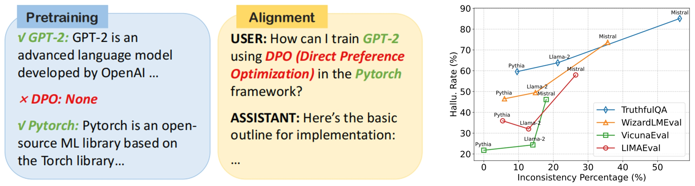
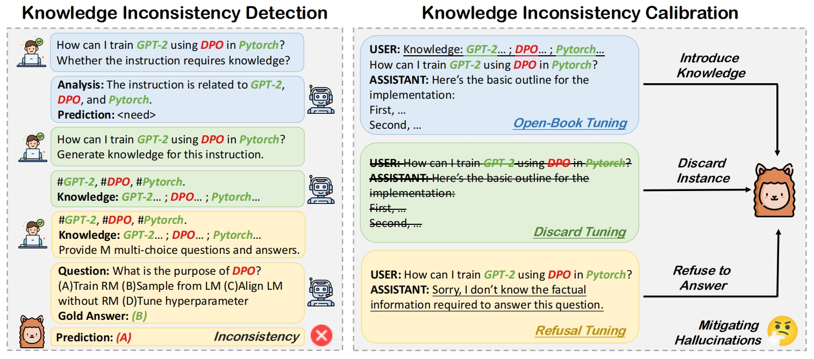
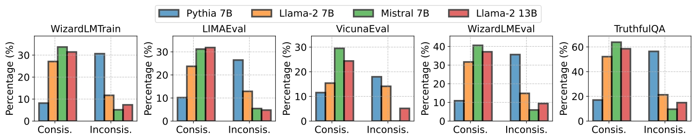
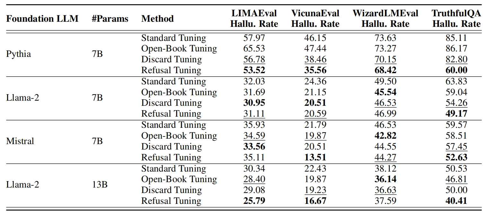
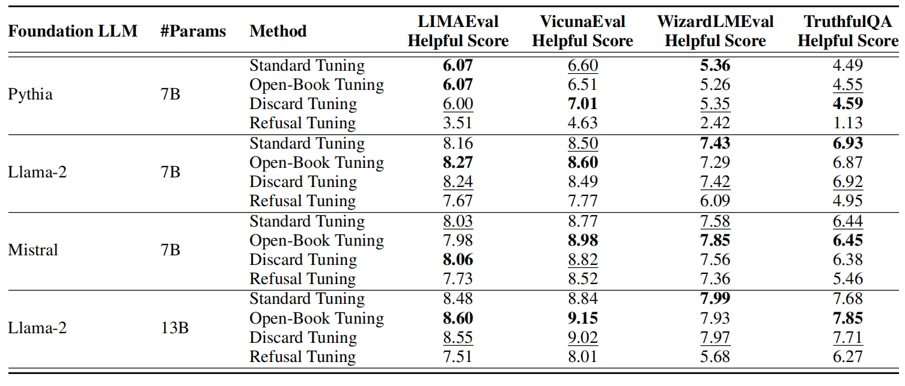

<p align="center" width="100%">
</p>

<div id="top" align="center">

Knowledge Verification to Nip Hallucination in the Bud
-----------------------------

[](https://github.com/tatsu-lab/stanford_alpaca/blob/main/LICENSE)
[](https://github.com/tatsu-lab/stanford_alpaca/blob/main/DATA_LICENSE)
[](https://github.com/tatsu-lab/stanford_alpaca/blob/main/WEIGHT_DIFF_LICENSE)
[](https://www.python.org/downloads/release/python-3110/)
[](https://github.com/psf/black)

<h4> |<a href="https://arxiv.org/abs/2401.10768"> 📑 Paper </a> |
<a href="https://huggingface.co/datasets/Wanfq/KCA_data"> 🤗 Data </a> |  
<a href="https://huggingface.co/models?sort=trending&search=KCA"> 🤗 Model </a> |
<a href="https://github.com/fanqiwan/KCA"> 🐱 Github Repo </a> |
</h4>

<!-- **Authors:** -->

_**Fanqi Wan<sup>†</sup>, Xinting Huang<sup>‡</sup>, Leyang Cui<sup>‡</sup>, Xiaojun Quan<sup>†</sup>, Wei Bi<sup>‡</sup>, Shuming Shi<sup>‡</sup>**_


<!-- **Affiliations:** -->


_<sup>†</sup> Sun Yat-sen University,
<sup>‡</sup> Tencent AI Lab_

</div>


## News
- **Jan 19, 2024:** 🔥 We're excited to announce that the KCA datasets for open-book tuning, discard tuning, and refusal tuning are now available on 🤗 [Huggingface Datasets](https://huggingface.co/datasets/Wanfq/KCA_data). The fine-tuned models are now available on 🤗 [Huggingface Models](https://huggingface.co/models?sort=trending&search=KCA). Happy exploring!

## Contents

- [Overview](#overview)
- [Data Release](#data-release)
- [Model Release](#model-release)
- [Knowledge Inconsistency Detection](#knowledge-inconsistency-detection)
- [Knowledge Inconsistency Calibration](#knowledge-inconsistency-calibration)
- [Evaluation](#evaluation)
- [License](#license)
- [Citation](#citation)
- [Acknowledgements](#acknowledgments)

## Overview
 
In this study, we demonstrate the feasibility of mitigating hallucinations by verifying and minimizing the inconsistency between external knowledge present in the alignment data and the intrinsic knowledge embedded within foundation LLMs.

<p align="center">
     <br>
</p>

Specifically, we propose a novel approach called Knowledge Consistent Alignment (KCA), which employs a well-aligned LLM to automatically formulate assessments based on external knowledge to evaluate the knowledge boundaries of foundation LLMs. To address knowledge inconsistencies in the alignment data, KCA implements several specific strategies to deal with these data instances, which involve (i) open-book tuning, (ii) discard tuning, and (iii) refusal tuning.

<p align="center">
     <br>
</p>

## Data Release

We release the KCA datasets for open-book tuning, discard tuning, and refusal tuning on [./data/processed_results](https://huggingface.co/datasets/Wanfq/KCA_data/tree/main/data/processed_results). Please note that each dataset is corresponding to a specific tuning method and a foundation LLM. The dataset is a structured data file in the JSON format. It consists of a list of dictionaries, with each dictionary containing multiple fields. Below is an example:

```
{
  "id": "...",  # Data index.
  "conversations": [
    {
      "from": "human",
      "value": "..."  # Human instruction.
    },
    {
      "from": "gpt",
      "value": "..."  # LLM response.
    }
  ],
  "class": "...",  # Three categories: "no_need_fact" (the instruction does not require knowledge), "need_and_have_fact" (the instruction requires knowledge and the foundation LLM understands the generated knowledge), "need_and_have_no_fact" (the instruction requires knowledge but the foundation LLM does not understand the generated knowledge).
  "analysis": "...",  # Analysis for whether the instruction requires knowledge.
  "knowledge": "..."  # Generated knowledge.
}
```

We show the percentage (%) of the consistent subset (the instruction requires knowledge and the foundation LLM understands the generated knowledge) and the inconsistent subset (the instruction requires knowledge but the foundation LLM does not understand the generated knowledge) across various foundation LLMs on different training and evaluation datasets as follows: 

<p align="center">
     <br>
</p>

## Model Release

We release the KCA models fine-tuned with different tuning methods on 🤗 [Huggingface Models](https://huggingface.co/models?sort=trending&search=KCA). Please note that each model is corresponding to a specific tuning method and a foundation LLM.

### Hallucination Mitigation

To facilitate a comprehensive evaluation, we conduct both LLM-based judgment and metric-based judgment. For the LLM-based judgment, we evaluate the performance on the LIMAEval, VicunaEval, WizardLMEval, and TruthfulQA benchmarks with GPT-4 to measure the hallucination rate. In terms of metric-based judgment, we assess the ROUGE-1, ROUGE-2, and ROUGE-L scores on the MS MARCO and ACI-Bench benchmarks.

The evaluation results of hallucination rate (%) on four public benchmarks for general instruction-following and truthful question answering with GPT-4 judgment are shown as follows, with a lower rate indicating better performance:

<p align="center">
     <br>
</p>

The evaluation results of ROUGE-1, ROUGE-2, and ROUGE-L on two public benchmarks for search and retrieve and clinical report generation are shown as follows, with a higher score indicating better performance:

<p align="center">
     <br>
</p>

### Helpfulness Maintenance

The evaluation results of the helpful score on four public benchmarks for general instruction-following and truthful question answering with GPT-4 judgment are shown as follows, where the helpful score ranges from one (worst) to ten (best):

<p align="center">
     <br>
</p>

## Knowledge Inconsistency Detection

To detect the inconsistency between external knowledge within the instruction-tuning (alignment) data and intrinsic knowledge embedded in the foundation LLMs obtained from pretraining, we propose a four-stage approach: (i) knowledge requirement classification, (ii) reference knowledge generation, (iii) examination formulation, and (iv) examination completion.

The results of knowledge inconsistency detection are in [./data/generated_results](https://huggingface.co/datasets/Wanfq/KCA_data/tree/main/data/generation_results) and [./data/examination](https://huggingface.co/datasets/Wanfq/KCA_data/tree/main/data/examination). You could download the results and put them in the right folder. If you want to reproduce the results, please follow the following commands step by step:

### Knowledge Requirements Classification
```
cd ./data_generation
export OPENAI_API_KEY=XXXXXX  # set the OpenAI API key
split=train  # train / test / test_truth
data_name=wizardlm_alpaca_single_turn  # wizardlm_alpaca_single_turn (train) / lima_testset_single_turn (test) / vicuna_testset_single_turn (test) / wizardlm_testset_single_turn (test) / truthfulqa_testset_single_turn (test_truth)
input_dir=../data/source/${split}
input_filename=${data_name}.jsonl
res_dir=../data/generation_results/${split}/fact_enhance_classify
res_filename=${data_name}_classify.jsonl
mode=fact_enhance_classify_en
batch_size=10

python3 per_instance_query.py \
    --data_dir ${input_dir} \
    --input ${input_filename} \
    --file_extension jsonl \
    --out_dir ${res_dir} \
    --output ${res_filename} \
    --prompt_mode ${mode} \
    --request_batch_size ${batch_size}

python3 post_process.py \
    --split ${split} \
    --stage fact_enhance_classify
```

### Reference Knowledge Generation
```
cd ./data_generation
export OPENAI_API_KEY=XXXXXX  # set the OpenAI API key
split=train  # train / test / test_truth
data_name=wizardlm_alpaca_single_turn  # wizardlm_alpaca_single_turn (train) / lima_testset_single_turn (test) / vicuna_testset_single_turn (test) / wizardlm_testset_single_turn (test) / truthfulqa_testset_single_turn (test_truth)
input_dir=../data/generation_results/${split}/fact_enhance_classify
input_filename=${data_name}_classify_parse_res_select_need.jsonl
res_dir=${global_dir}/generation_results/${split}/fact_generation
res_filename=${data_name}_classify_parse_res_select_need_knowledge_gen.jsonl
mode=fact_generation_en
batch_size=10

python3 per_instance_query.py \
    --data_dir ${input_dir} \
    --input ${input_filename} \
    --file_extension jsonl \
    --out_dir ${res_dir} \
    --output ${res_filename} \
    --prompt_mode ${mode} \
    --request_batch_size ${batch_size}

python3 post_process.py \
    --split ${split} \
    --stage fact_generation
```

### Examination Formulation
```
cd ./data_generation
export OPENAI_API_KEY=XXXXXX  # set the OpenAI API key
split=train  # train / test / test_truth
data_name=wizardlm_alpaca_single_turn  # wizardlm_alpaca_single_turn (train) / lima_testset_single_turn (test) / vicuna_testset_single_turn (test) / wizardlm_testset_single_turn (test) / truthfulqa_testset_single_turn (test_truth)
input_dir=../data/generation_results/${split}/fact_generation
input_filename=${data_name}_classify_parse_res_select_need_knowledge_gen_parse_res.jsonl
res_dir=${global_dir}/generation_results/${split}/test_generation
res_filename=${data_name}_classify_parse_res_select_need_knowledge_gen_parse_res_test_gen.jsonl
mode=fact_to_tests_en
batch_size=10

python3 per_instance_query.py \
    --data_dir ${input_dir} \
    --input ${input_filename} \
    --file_extension jsonl \
    --out_dir ${res_dir} \
    --output ${res_filename} \
    --prompt_mode ${mode} \
    --request_batch_size ${batch_size}

python3 post_process.py \
    --split ${split} \
    --stage test_generation
```

### Examination Completion

```
cd ./
split=train  # train / test / test_truth
data_name=wizardlm_alpaca_single_turn  # wizardlm_alpaca_single_turn (train) / lima_testset_single_turn (test) / vicuna_testset_single_turn (test) / wizardlm_testset_single_turn (test) / truthfulqa_testset_single_turn (test_truth)
mv ./data_generation/generation_results/${split}/test_generation/${data_name}_classify_parse_res_select_need_knowledge_gen_parse_res_test_gen_normalize.jsonl ./data/examination/input/hallucination/${split}/${data_name}_classify_parse_res_select_need_knowledge_gen_parse_res_test_gen_normalize_test.jsonl
export CUDA_VISIBLE_DEVICES=0
test_dataset=hallucination
eval_batch_size=1  # must set to 1
shot=5
model_name=llama-2-7b  # pythia-6.9b / llama-2-7b / mistral-7b-v0.1 / llama-2-13b
output_dir=./data/examination/output/${test_dataset}/${split}/${model_name}/${shot}-shot
data_dir=./data/examination/input/${test_dataset}/${split}

python3 ./examination/${test_dataset}/run_eval.py \
    --ntrain ${SHOT} \
    --data_dir ${data_dir} \
    --save_dir ${output_dir} \
    --model_name_or_path ${model_name} \
    --tokenizer_name_or_path ${model_name} \
    --eval_batch_size ${eval_batch_size} \
    --use_slow_tokenizer

python3 ./examination/${test_dataset}/get_metric.py
```

## Knowledge Inconsistency Calibration

Since knowledge inconsistency could mislead foundation LLMs during alignment and lead to hallucinations, we propose three specific strategies to manage instances in Dinc, including (i) open-book tuning, which appends the generated knowledge snippets to the instructions, (ii) discard tuning, which discards both the instructions and responses, and (iii) refusal tuning, which changes the responses to a refusal format.

The results of knowledge inconsistency calibration are in [./data/processed_results](https://huggingface.co/datasets/Wanfq/KCA_data/tree/main/data/processed_results). You could download the results and put them in the right folder. If you want to reproduce the results, please follow the following commands step by step:

### Data Construction

First, we construct training data for these tuning methods:

```
cd ./
python3 ./data_generation/inconsistency_processing.py 
```

### Fine-Tuning

Then, we fine-tune the foundation LLMs using these tuning methods:
 
```
cd ./
export CUDA_VISIBLE_DEVICES=0,1,2,3,4,5,6,7
MODEL_NAME=llama-2-7b  # pythia-6.9b / llama-2-7b / mistral-7b-v0.1 / llama-2-13b
DATA_NAME=wizardlm_trainset_sorry  # wizardlm_alpaca_train (baseline) / wizardlm_trainset_openbook (kca open-book tuning) / wizardlm_trainset_drop (kca discarding tuning) / wizardlm_trainset_sorry (kca refusal tuning)
DATA_PATH=./data/processed_results/${MODEL_NAME}_shot-5_${DATA_NAME}.json  # ./data/processed_results/${DATA_NAME}.json (baseline) / ./data/processed_results/${MODEL_NAME}_shot-5_${DATA_NAME}.json (kca) 
CONV_TEMP=vicuna
OUTPUT_DIR=./training_results/${MODEL_NAME}_shot-5_${DATA_NAME}  # ./training_results/baseline_${MODEL_NAME}_${DATA_NAME} (baseline) / ./training_results/${MODEL_NAME}_shot-5_${DATA_NAME} (kca)
LOG_FILE=./training_loggings/${MODEL_NAME}_shot-5_${DATA_NAME}.log  # ./training_loggings/baseline_${MODEL_NAME}_${DATA_NAME}.log (baseline) / ./training_loggings/${MODEL_NAME}_shot-5_${DATA_NAME}.log (kca) 

torchrun --nproc_per_node=8 --master_port=20001 ./train/train.py \
    --model_name_or_path ${MODEL_NAME}  \
    --data_path ${DATA_PATH} \
    --bf16 True \
    --output_dir ${OUTPUT_DIR} \
    --num_train_epochs 3 \
    --per_device_train_batch_size 8 \
    --per_device_eval_batch_size 8 \
    --gradient_accumulation_steps 2 \
    --evaluation_strategy "no" \
    --save_strategy "steps" \
    --save_steps 500 \
    --save_total_limit 1 \
    --learning_rate 2e-5 \
    --weight_decay 0. \
    --warmup_ratio 0.03 \
    --lr_scheduler_type "cosine" \
    --logging_steps 1 \
    --fsdp "full_shard auto_wrap" \
    --fsdp_transformer_layer_cls_to_wrap "LlamaDecoderLayer" \
    --tf32 True \
    --model_max_length 2048 \
    --gradient_checkpointing True \
    --conv_temp ${CONV_TEMP} \
    --lazy_preprocess True \
    --flash_attn_transformers True 2>&1 | tee ${LOG_FILE}
```

## Evaluation

We evaluate both the hallucination rate and helpfulness score of the fine-tuned LLMs. For hallucination evaluation, we conduct both LLM-based judgment and metric-based judgment. For helpfulness evaluation, we conduct LLM-based judgment.

### Hallucination Evaluation

Below are the scripts for hallucination evaluation.

```
# ========== LLM-Based Judgment (LIMAEval, VicunaEval, WizardLMEval, TruthfulQA) ==========
# Generate model answers
export CUDA_VISIBLE_DEVICES=0,1,2,3,4,5,6,7
NUM_GPUS=8
MODEL_NAME=llama-2-7b  # pythia-6.9b / llama-2-7b / mistral-7b-v0.1 / llama-2-13b
DATA_NAME=wizardlm_trainset_sorry  # wizardlm_alpaca_train (baseline) / wizardlm_trainset_openbook (kca open-book tuning) / wizardlm_trainset_drop (kca discarding tuning) / wizardlm_trainset_sorry (kca refusal tuning)
MODEL_ID=${MODEL_NAME}_shot-5_${DATA_NAME}  # baseline_${MODEL_NAME}_${DATA_NAME} (baseline) / ${MODEL_NAME}_shot-5_${DATA_NAME} (kca)
MODEL_PATH=./training_results/${MODEL_ID}
QUESTION_NAME=lima_testset # lima_testset / vicuna_testset / wizardlm_testset / truthfulqa_test_truthset
QUESTION_FILE=./data/processed_results/${MODEL_NAME}_shot-5_${QUESTION_NAME}_sorry.json  # do not use _openbook or _drop
ANSWER_FILE=./evaluation_results/answer_greedy/data-${MODEL_NAME}_shot-5_${QUESTION_NAME}_model-${MODEL_ID}_greedy.jsonl

python3 ./eval/gpt_judge/gen_answer.py \
    --model-path ${MODEL_PATH} \
    --model-id ${MODEL_ID} \
    --conv-temp vicuna \
    --question-file ${QUESTION_FILE} \
    --answer-file ${ANSWER_FILE} \
    --num-gpus ${NUM_GPUS}

# GPT-4 judgment
export OPENAI_API_KEY=XXXXXX  # set the OpenAI API key
MODEL_NAME=llama-2-7b  # pythia-6.9b / llama-2-7b / mistral-7b-v0.1 / llama-2-13b
DATA_NAME=wizardlm_trainset_sorry  # wizardlm_alpaca_train (baseline) / wizardlm_trainset_openbook (kca open-book tuning) / wizardlm_trainset_drop (kca discarding tuning) / wizardlm_trainset_sorry (kca refusal tuning)
MODEL_ID=${MODEL_NAME}_shot-5_${DATA_NAME}  # baseline_${MODEL_NAME}_${DATA_NAME} (baseline) / ${MODEL_NAME}_shot-5_${DATA_NAME} (kca)
QUESTION_NAME=lima_testset # lima_testset / vicuna_testset / wizardlm_testset / truthfulqa_test_truthset
JUDGE_TYPE=hallucination_judge
ANSWER_FILE=./evaluation_results/answer_greedy/data-${MODEL_NAME}_shot-5_${QUESTION_NAME}_model-${MODEL_ID}_greedy.jsonl
TESTSET_FILE=./data/processed_results/${MODEL_NAME}_shot-5_${QUESTION_NAME}_sorry.json  # do not use _openbook or _drop
REVIEW_FILE=./evaluation_results/review_greedy/data-${MODEL_NAME}_shot-5_${QUESTION_NAME}_model-${MODEL_ID}_${JUDGE_TYPE}_greedy.jsonl
PROMPT_FILE=./eval/gpt_judge/gpt_judge_prompt.jsonl
BATCH_SIZE=3

python3 ./eval/gpt_judge/gpt_judge.py \
    --answer_file ${ANSWER_FILE} \
    --testset_file ${TESTSET_FILE} \
    --review_file ${REVIEW_FILE} \
    --prompt_file ${PROMPT_FILE} \
    --prompt_type ${JUDGE_TYPE} \
    --review_model gpt-4 \
    --batch_size ${BATCH_SIZE} \
    --use_demo \
    --no_sorry  # only when "DATA_NAME=wizardlm_trainset_sorry"

python3 ./eval/gpt_judge/show_results.py
```

```
# ======================= Metric-Based Judgment (MS-MARCO, ACI-Bench) ======================
export CUDA_VISIBLE_DEVICES=0,1,2,3,4,5,6,7
NUM_GPUS=8
MODEL_NAME=llama-2-7b  # pythia-6.9b / llama-2-7b / mistral-7b-v0.1 / llama-2-13b
DATA_NAME=wizardlm_trainset_sorry  # wizardlm_alpaca_train (baseline) / wizardlm_trainset_openbook (kca open-book tuning) / wizardlm_trainset_drop (kca discarding tuning) / wizardlm_trainset_sorry (kca refusal tuning)
MODEL_ID=${MODEL_NAME}_shot-5_${DATA_NAME}  # baseline_${MODEL_NAME}_${DATA_NAME} (baseline) / ${MODEL_NAME}_shot-5_${DATA_NAME} (kca)
MODEL_PATH=./training_results/${MODEL_ID}
QUESTION_NAME=msmacro  #  msmacro / acibench
QUESTION_FILE=./data/metric_based_evaluation/${QUESTION_NAME}_testset.jsonl
ANSWER_FILE=./evaluation_results/answer_greedy/data-${MODEL_NAME}_shot-5_${QUESTION_NAME}_model-${MODEL_ID}_greedy.jsonl

python3 ./eval/gpt_judge/gen_summary.py \
    --model-path ${MODEL_PATH} \
    --model-id ${MODEL_ID} \
    --conv-temp vicuna \
    --question-file ${QUESTION_FILE} \
    --answer-file ${ANSWER_FILE} \
    --num-gpus ${NUM_GPUS} \
    --no-sorry  # only when "DATA_NAME=wizardlm_trainset_sorry"
```

### Helpfulness Evaluation

Below are the scripts for helpfulness evaluation.

```
# ========== LLM-Based Judgment (LIMAEval, VicunaEval, WizardLMEval, TruthfulQA) ==========
# GPT-4 judgment
export OPENAI_API_KEY=XXXXXX  # set the OpenAI API key
MODEL_NAME=llama-2-7b  # pythia-6.9b / llama-2-7b / mistral-7b-v0.1 / llama-2-13b
DATA_NAME=wizardlm_trainset_sorry  # wizardlm_alpaca_train (baseline) / wizardlm_trainset_openbook (kca open-book tuning) / wizardlm_trainset_drop (kca discarding tuning) / wizardlm_trainset_sorry (kca refusal tuning)
MODEL_ID=${MODEL_NAME}_shot-5_${DATA_NAME}  # baseline_${MODEL_NAME}_${DATA_NAME} (baseline) / ${MODEL_NAME}_shot-5_${DATA_NAME} (kca)
QUESTION_NAME=lima_testset # lima_testset / vicuna_testset / wizardlm_testset / truthfulqa_test_truthset
JUDGE_TYPE=effectiveness_judge
ANSWER_FILE=./evaluation_results/answer_greedy/data-${MODEL_NAME}_shot-5_${QUESTION_NAME}_model-${MODEL_ID}_greedy.jsonl
TESTSET_FILE=./data/processed_results/${MODEL_NAME}_shot-5_${QUESTION_NAME}_sorry.json  # do not use _openbook or _drop
REVIEW_FILE=./evaluation_results/review_greedy/data-${MODEL_NAME}_shot-5_${QUESTION_NAME}_model-${MODEL_ID}_${JUDGE_TYPE}_greedy.jsonl
PROMPT_FILE=./eval/gpt_judge/gpt_judge_prompt.jsonl
BATCH_SIZE=3

python3 ./eval/gpt_judge/gpt_judge.py \
    --answer_file ${ANSWER_FILE} \
    --testset_file ${TESTSET_FILE} \
    --review_file ${REVIEW_FILE} \
    --prompt_file ${PROMPT_FILE} \
    --prompt_type ${JUDGE_TYPE} \
    --review_model gpt-4 \
    --batch_size ${BATCH_SIZE} \
    --use_demo

python3 ./eval/gpt_judge/show_results.py
```

## License

KCA is intended and licensed for research use only. The dataset is CC BY NC 4.0 (allowing only non-commercial use) and models trained using the dataset should not be used outside of research purposes. The weights of KCA models are also CC BY NC 4.0 (allowing only non-commercial use).

## Citation

If you find this work is relevant to your research or applications, please feel free to cite our work!
```
@misc{wan2024mitigating,
      title={Mitigating Hallucinations of Large Language Models via Knowledge Consistent Alignment}, 
      author={Fanqi Wan and Xinting Huang and Leyang Cui and Xiaojun Quan and Wei Bi and Shuming Shi},
      year={2024},
      eprint={2401.10768},
      archivePrefix={arXiv},
      primaryClass={cs.CL}
}
```

## Acknowledgments

This repo benefits from [Stanford-Alpaca](https://github.com/tatsu-lab/stanford_alpaca) and [Explore-Instruct](https://github.com/fanqiwan/Explore-Instruct). Thanks for their wonderful work!
